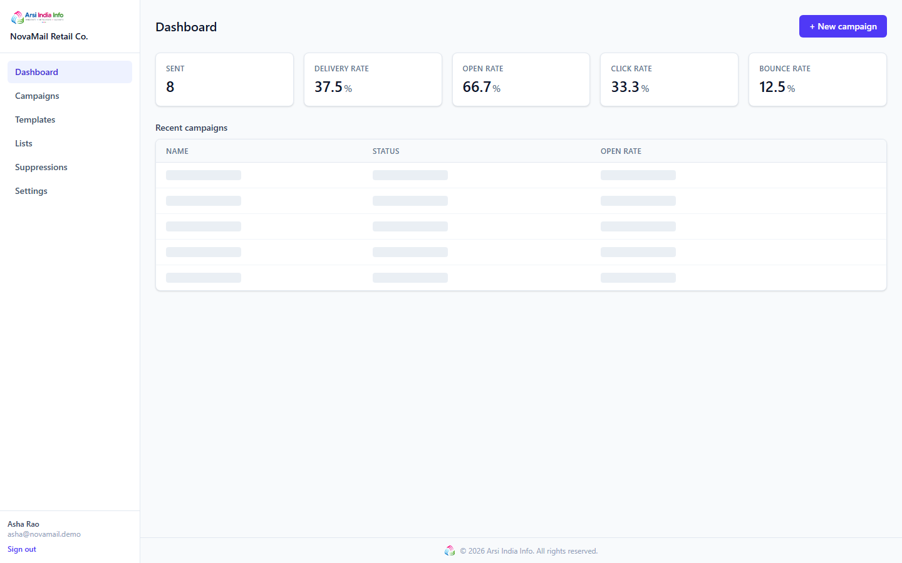
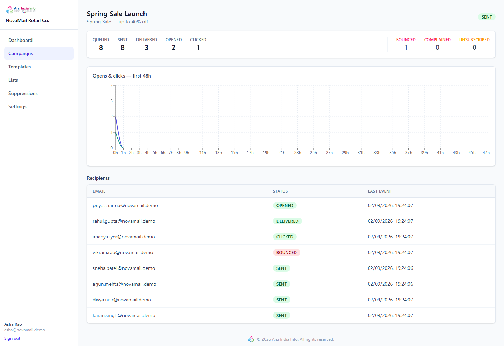
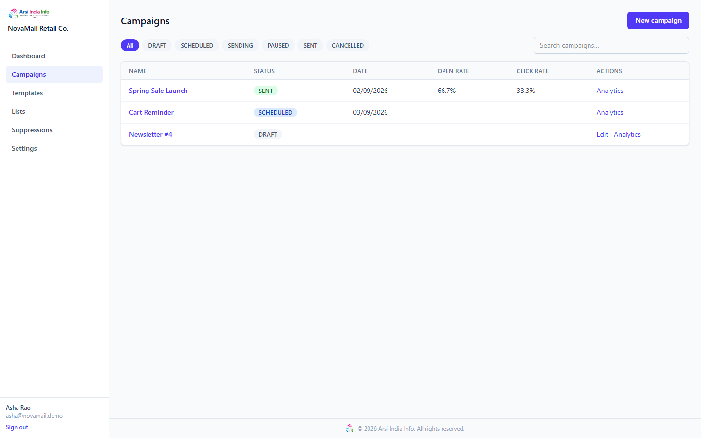
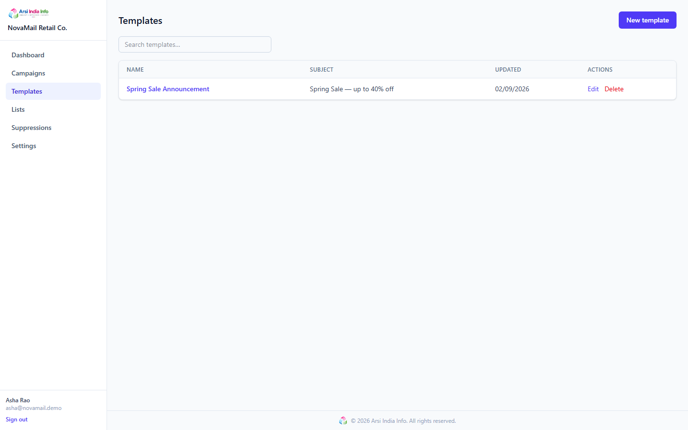
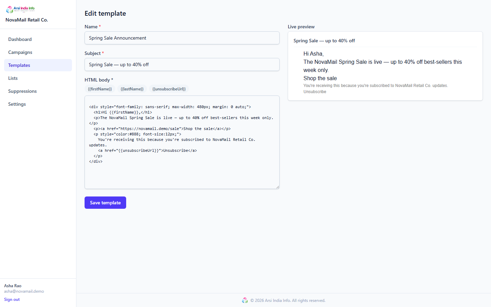
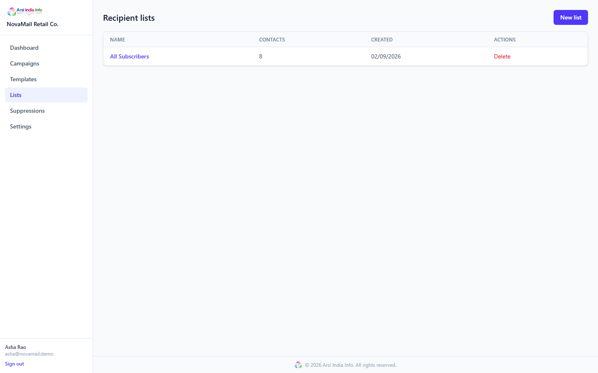
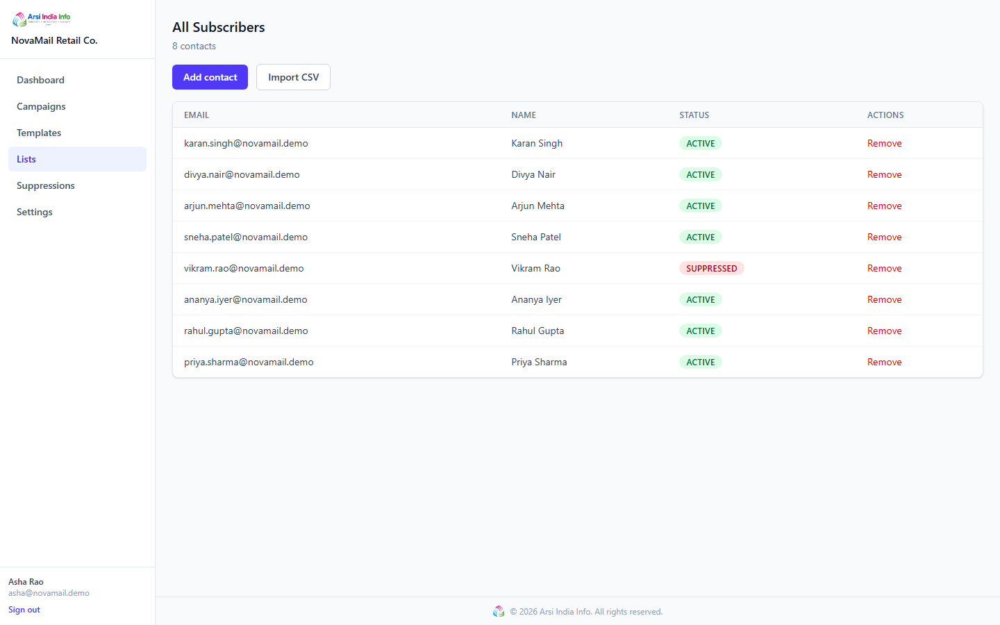
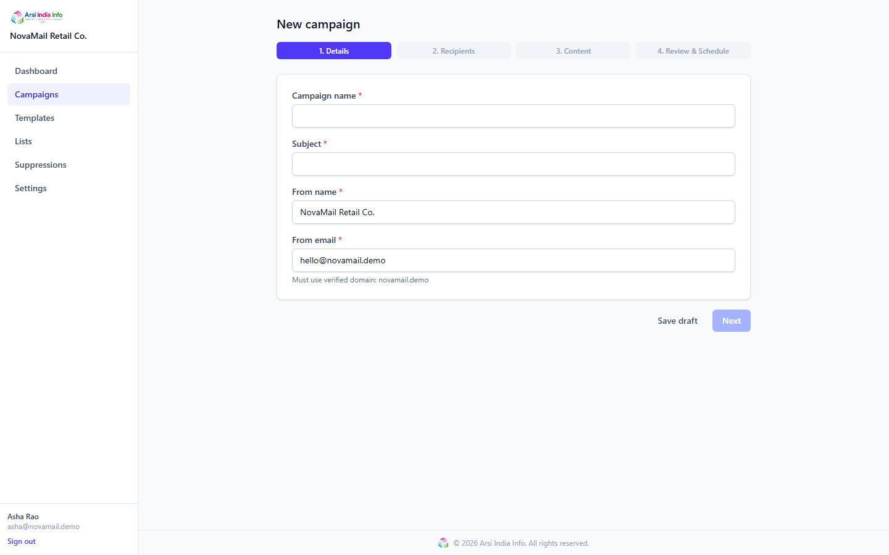
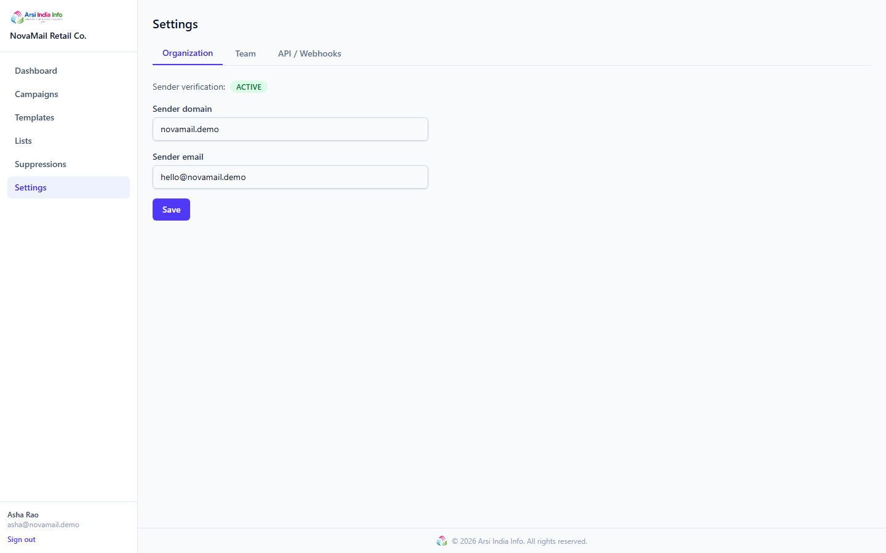

# Portfolio Demo Walkthrough (~5 minutes)

This walks through the full campaign lifecycle using only the Docker Compose
stack and Mailhog as a stand-in inbox — no real email is ever sent.

## 1. Start the stack and seed data

```bash
docker compose -f infrastructure/docker-compose.yml up --build -d
cd backend && npm run seed
```

The seed script creates the fictional **NovaMail Retail Co.** organization
with:

- Owner login: seeded demo account (credentials are not published in this repo)
- Two more team members (a marketer, an analyst)
- A verified sender domain (`novamail.demo`, demo-simulated verification)
- One contact list, "All Subscribers", with 8 synthetic `*.demo` contacts
- One template with a required unsubscribe merge tag
- Three campaigns in different lifecycle states:
  - **Newsletter #4** — `DRAFT`
  - **Cart Reminder** — `SCHEDULED` for 24h from now
  - **Spring Sale Launch** — `SENT`, with a simulated open/click/bounce
    funnel already populated

## 2. Sign in and look around

Open http://localhost:5173, sign in as the owner, and check:

- **Dashboard** — KPI row + recent campaigns table

  

- **Campaigns → Spring Sale Launch** — funnel chart (Queued → Sent →
  Delivered → Opened → Clicked, with Bounced/Complained side-counts), the
  opens/clicks time-series chart, and the per-recipient status table

  

## 3. Watch a real send happen

Create a new campaign against the seeded list and template, then **Schedule
→ Send now**. Within a few seconds:

- The worker process picks up the send job and calls the `EmailProvider`
  (Mailhog in this stack) — open http://localhost:8025 to see the actual
  rendered email, tracking pixel, and rewritten links.
- The campaign's status flips `SENDING` → `SENT` once every recipient has
  been dispatched.

## 4. Trigger delivery events

- Open the email in Mailhog and click a link — this hits `GET /t/c/:token`,
  which records a `CLICKED` (and implied `OPENED`) event and redirects to the
  real destination.
- Simulate a bounce/complaint by POSTing a signed SES/SNS-shaped payload to
  `POST /api/v1/webhooks/ses` (see `docs/testing.md` for the HMAC signing
  scheme) — the recipient moves to `BOUNCED`/`COMPLAINED` and is immediately
  added to the suppression list.
- Reload the campaign detail page — the funnel and time-series chart update
  live (polled every 15s while a campaign is `SENDING`).

## 5. Try the guardrails

- **Tenant isolation**: register a second organization, and confirm you get
  a `404` (not a `403`) trying to view the first org's campaign by id.
- **Optimistic locking**: open the same draft campaign in two tabs, edit and
  save in one, then try to save a stale edit in the other — expect
  `409 VERSION_CONFLICT`.
- **Idempotent unsubscribe**: click a one-click unsubscribe link twice — the
  second call is a no-op success, not an error.

## Screenshots

The rest of the app, for reference — all captured against the seeded
NovaMail Retail Co. data:

**Campaigns list** — every lifecycle state side by side (draft, scheduled, sent):



**Templates list**:



**Template editor** — merge-field shortcuts and a live preview pane:



**Recipient lists**:



**List detail** — note the auto-suppressed contact from the simulated bounce:



**New campaign wizard** — org sender defaults applied automatically:



**Settings** — sender domain verification:


